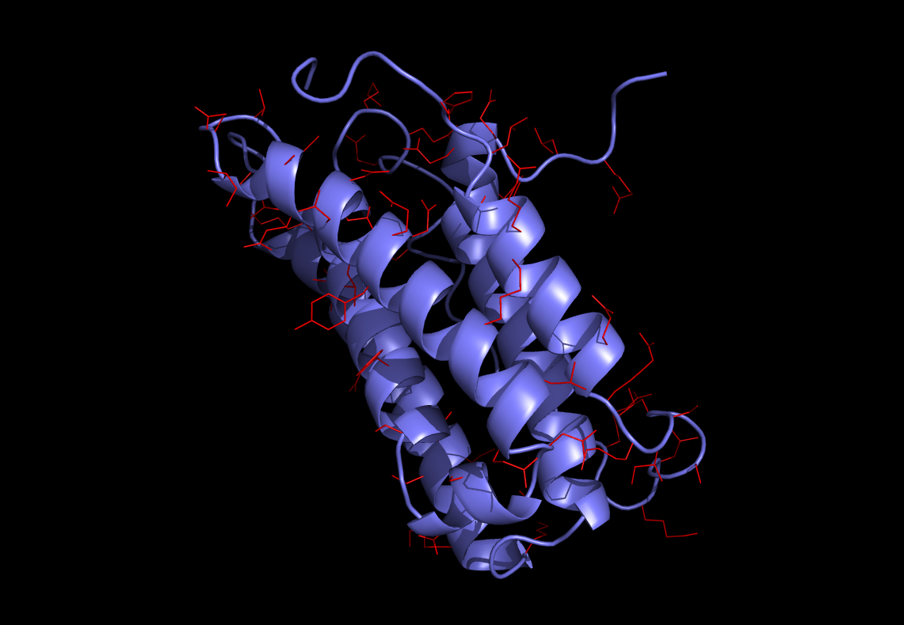
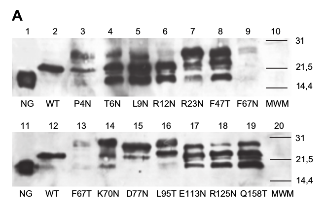

# 1itf
Glycosylating interferon alpha

  

Interferon alpha is used to treat a variety of conditions where its antiviral and antitumor activities can be of benefit [Friedman Br J Clin Pharmacol. 2008 Feb; 65(2): 158–162 (doi:10.1111%2Fj.1365-2125.2007.03055.x)]. This molecule and various glycoforms were extensively studied by Ceaglio et al. Biochimie 90 (2008) 437-449 (doi:10.1016/j.biochi.2007.10.013). Using their own method to select potential glycosylation sites, an assortment of 14 individual N-linked glycoforms and a number of combinations were produced. I found the western blot of the individual glycoforms which may be seen in figure 1A of Ceaglio et al. referenced above to be of interest.
<!---

  

  Figure 1A from Ceaglio et al. Biochimie 90 (2008) 437-449 (doi:10.1016/j.biochi.2007.10.013)

-->
The wild type molecule is glycosylated efficiently. There is a single band representing the O-linked glycoform. So what might one expect to see after introducing an N-linked glycosylation site into a protein that already has an efficiently glycosylated O-linked glycan? One might expect to see a population of molecules with O-linked glycans, a population with N-linked glycans and a population with both. That there might be populations with single glycans of one form of the other might be expected because the presence of the first glycan that is attached to the molecule might inhibit the attachment of the second. Of course one might also expect a population with both glycans because the presence of one glycan might not always block the attachment of the other. Indeed if we look closely at the data, in a number of cases we see evidence that the middle band sometimes appears to be split which might suggest the presence of two forms of singly glycosylated molecules along with a band that likely represents the doubly glycosylated form. Strikingly, we also sometimes see a fourth type of molecule in the data. We see a significant population of what appear to be completely unglycosylated molecules in almost every one of the molecules into which an N-linked glycosylation site was introduced. How does one explain this? How could the introduction of an N-linked glycosylation site inhibit the glycosylation of the original O-linked glycosylation site as well as having the introduced N-linked site fail to glycosylate, especially since the original wild type molecule is glycosylated so efficiently? I can't say that I know the answer to this question, but if we are producing artificially glycosylated molecules, it seems to me that one might prefer molecules that are efficiently expressed and efficiently glycosylated.

It is not necessarily straightforward to ascertain expression levels from a western blot, but informally, it appears that both the F67N and the F67T mutants display bands that are very dim and therefore may have been expressed inefficiently. Likewise, the P4N mutant appears dimmer than the others. The P4N mutant changes a proline. Changing a proline can change the geometry of the protein's backbone. Even when this geometrical change is near one of the protein's termini, it could easily inhibit proper folding. If the protein has not folded properly, it might be eliminated by the "protein quality assurance" system. So to the extent that the P4N mutant has reduced expression, the above mentioned aspects of proline mutations might explain it. Having said all of that, gly21 does not predict proline mutations for the above-mentioned reasons.

We informally ascertain the glycosylation efficiency of the remaining molecules by the strength of the band representing the unglycosylated population of the molecules. The D77N molecule appears to be the most efficiently glycosylated molecule with L95T following at a close second. R23N and K70N show a dim band representing the unglycosylated molecules and appear to be in third and fourth place, but not necessarily in that order. The rest of the molecules show significant populations of unglycosylated molecules.

In all, gly21 predicts 64 sites that might make good places to introduce N-linked glycosylation sites. Of the molecules produced by Ceaglio et al., gly21 predicts the following sites:

9 = L9N, 23 = R23N, 77 = D77N, 93 = L95T, 125 = R125N, and 156 = Q158T.

So of the three sites that might be considered to be inefficiently expressed, P4N, F67N and F67T, gly21 does not predict any of them. Of the four most efficiently glycosylated molecules D77N, L95T, R23N and K70N, gly21 predicts three of them and gly21 predicts both of the two most efficiently glycosylated molecules D77N and L95T. Of the remaining molecules that are inefficiently glycosylated, gly21 predicts three of them, L9N, R125N and Q158T. So out of 14 molecules, if we consider the accuracy in discriminating between molecules that are efficiently expressed and glycosylated and those that aren't we arguably see 4 "misses" and 10 "hits." So it looks like our prediction accuracy on this data set is around 71%.

So from a practical standpoint what does this all mean? If one is only interested in the two best expressed and efficiently glycosylated molecules, D77N and L95T, then we reduced the number of experiments necessary to find them from 14 to 6. From molecules 3 and 4, R23N and K70N, to find the molecule that gly21 didn't predict one would need to do 8 additional experiments. But more to the point, beyond the six molecules from the Ceaglio et al. experiments that gly21 predicted, gly21 predicts 58 additional sites, some of which might be excellent places to add N-linked glycosylation sites. Although we would not like to predict our accuracy on these other sites, it seems possible that interferon alpha may have a number of excellent quality candidates for N-linked glycosylation that remain to be discovered.

